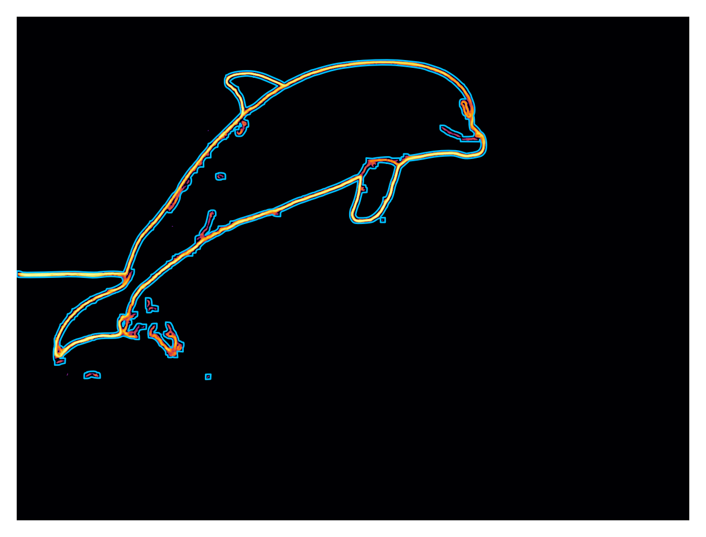

# Create activity route from input images.

## Some bare-bone route segments are shown [here](https://ssarkarbht.github.io/map-art/)

The ML pipeline takes an input image and applies image segmentation and edge detection to extract the raster line drawing image from it. The next steps perform some parametrization to get a space (interpolation function) and time-ordered (image vectorization followed by bounding box sequencing) model of the image. The parametrized model is then transleted to map network data to find an optimized route that (somewhat) resembles the inpute image.

Some intermediate image processing steps are shown below:

  
  

  

