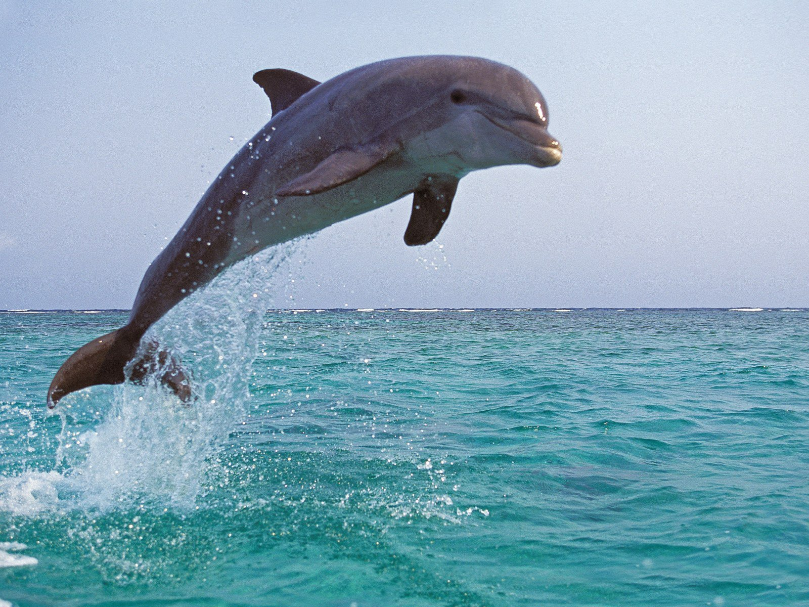

## [Project Summary](https://www.linkedin.com/pulse/imprinting-images-map-sourav-sarkar-ph-d-)
## [Project Repository](https://github.com/ssarkarbht/map-art) 
## Example Routes
Here's some sample map routes created from images!

  
  
  
  

<iframe src="resources/interactive_map.html" height="600" width="1000"></iframe>

You can explore this map [as its own web page here](https://github.com/ssarkarbht/map-art/blob/main/resources/interactive_map.html).
